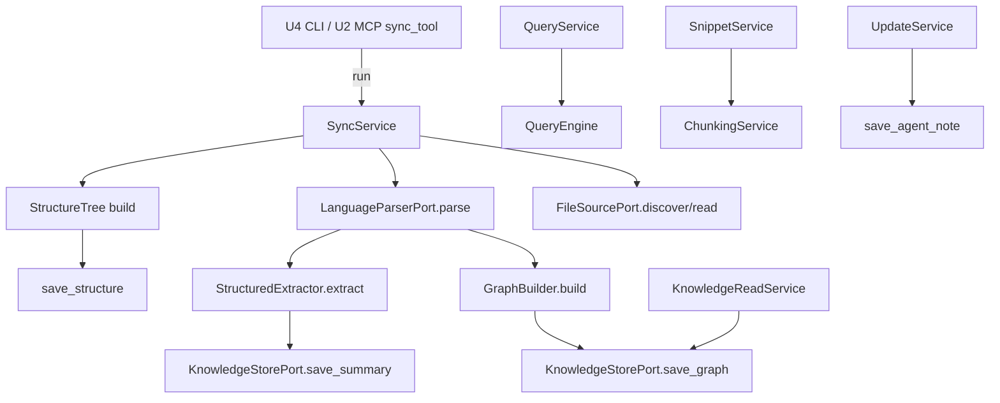
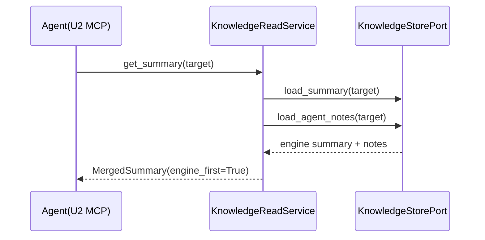

# Business Logic Model — U1 Engine Core

> **단계**: CONSTRUCTION – Functional Design · **Unit: U1 Engine Core**
> **작성일**: 2026-09-08
> **원칙**: 도메인 로직은 순수·결정적·LLM 미호출·I/O 없음(NFR-C3). I/O는 포트/아웃바운드 어댑터로 격리.

---

## 1. 계층·데이터 흐름 개요

**텍스트 대안**: 인바운드(U2/U4)가 `SyncService.run`을 호출 → 소스 수집(FileSourcePort) → 파싱(LanguageParserPort) → 그래프(GraphBuilder)·구조요약(StructuredExtractor)·구조트리 생성 → 저장(KnowledgeStorePort). 읽기 계열은 `KnowledgeReadService`가 저장소를, `QueryService`는 `QueryEngine`을, `SnippetService`는 `ChunkingService`를, `UpdateService`는 노트 저장을 사용.

---

## 2. Application 서비스 로직

### 2.1 SyncService.run(project_root, mode='full'|'resync') -> SyncReport
파이프라인 조율. 순서:
1. `t0 = clock()` (계측, US-N7)
2. `files = FileSourcePort.discover(root, filters)` — 지원 확장자만(미지원은 discover 단계에서 제외, skipped 기록). (US-E1 AC-2)
3. 각 파일에 대해:
   - `sha` 계산 → **mode='resync'이고 저장된 sha와 동일하면 skip**(재처리 최소화, US-N7 AC-1). skipped에 "unchanged" 기록.
   - `parser = ParserRegistry.for_file(path)`; `None`이면 skipped("no parser") 후 계속(US-N4 AC-2).
   - `try: unit = parser.parse(file)` 실패 시 failures에 사유 기록 후 계속(US-E2 AC-3, Q7=A).
   - `summary = StructuredExtractor.extract(unit)` → `save_summary`
   - 파싱 유닛 누적(그래프용)
4. `graph = GraphBuilder.build(all_units)` → `save_graph`
5. `tree = build_structure_tree(files)` → `save_structure`
6. **에이전트 노트 보존(Q6=A)**: 노트 네임스페이스는 건드리지 않음. 대상이 사라진 노트는 orphan 표시만.
7. `duration_ms = clock() - t0`; `SyncReport(files_total, symbols_total, skipped, failures, duration_ms)` 반환.

- **mode='full'**: 저장된 엔진 산출물(구조/요약/그래프) 전체 재생성·덮어쓰기. mode='resync': 변경분만 재생성(sha 비교), 미변경 skip. 두 모드 모두 에이전트 노트 보존.

### 2.2 KnowledgeReadService
- `get_structure() -> StructureTree | None` — 저장된 트리 로드. 없으면 None(US-A1 AC-4).
- `get_summary(target) -> MergedSummary | None`:
  1. `engine = store.load_summary(target)`
  2. `notes = store.load_agent_notes(target)`
  3. 둘 다 없으면 None. 아니면 `MergedSummary(target, engine, notes, engine_first=True)` (Q5=A).
- `get_relationships(target=None) -> RelationshipGraph | None`:
  - `target=None`이면 전체 그래프, 지정 시 해당 심볼의 유도 부분그래프(인접 엣지 포함).
- **계측(US-N1 AC-2)**: 모든 조회는 지연 계측 훅(`measure(name)`)을 통과, 응답시간 로깅.

### 2.3 QueryService.query(text, mode='keyword'|'graph'|'auto') -> list[SearchResult]
- `auto`: `text`가 심볼 id/정규이름 패턴이면 graph, 아니면 keyword로 위임.
- `keyword`: `QueryEngine.search_keyword(index, text)`
- `graph`: 대상 심볼 파싱 후 `QueryEngine.neighbors(graph, symbol_id, direction)` (기본 방향 auto→callers+callees)
- 무매칭 시 빈 리스트(US-A2 AC-3). 결과 정렬은 score desc, 동점 target asc(결정성).

### 2.4 SnippetService.snippet(target, token_budget) -> Snippet
1. 대상 심볼/파일의 원문 범위 확보(store에서 위치 + source 로드).
2. `ChunkingService.select_snippet(symbol, source_text, token_budget)` 위임.
3. 반환 Snippet의 `estimated_tokens <= token_budget` 보장.

### 2.5 UpdateService.apply_note(payload) -> UpdateResult
1. **검증**(business-rules 참조): target 비어있지 않음, body_md 비어있지 않음, author 존재, created_at ISO 형식.
2. 실패 시 변경 없이 `UpdateResult(ok=False, errors=[...])`(US-A4 AC-3).
3. 성공 시 `AgentNote` 생성(note_id 결정적) → `store.save_agent_note(note)` → `UpdateResult(ok=True, note_id)`.
4. 엔진 산출물은 절대 수정하지 않음(엔진 우선 정책, 노트는 별도 네임스페이스).

---

## 3. 도메인 순수 로직 (알고리즘)

### 3.1 GraphBuilder.build(units) -> RelationshipGraph
- 노드: 모든 unit의 symbols 수집, `id` 기준 dedup, id 오름차순 정렬.
- 심볼 테이블: `{qualified_name/name -> symbol.id}` (동일 이름 다수면 파일 내 우선, 그 외 경로 오름차순 첫 매칭).
- 엣지: 각 Reference의 `dst_name`을 심볼 테이블로 해석 → 해석되면 `Edge(src_symbol, resolved_id, kind)`. 미해결 참조는 드롭(외부/표준 라이브러리로 간주).
- 엣지 dedup + `(src,dst,kind)` 오름차순 정렬.
- **결정성(PBT-03)**: 동일 units 입력 → 동일 그래프. 중복 엣지 없음. 모든 엣지 端점 ∈ 노드.

### 3.2 StructuredExtractor.extract(unit) -> ModuleSummary
- signatures: function/class/method 심볼의 시그니처 문자열(위치순).
- docstrings: DocElement.kind=='docstring' 텍스트(정규화: 공백 트림).
- headings: kind=='heading' 텍스트, `#`×level 접두 유지(Markdown).
- comments: kind=='comment' 중 대표(길이/위치 기준 상위 N개, 결정적 선별).
- **LLM 미호출·결정적**(US-E3 AC-2/AC-3, NFR-C3).

### 3.3 ChunkingService
- `estimate_tokens(text)`: `ceil(len(text)/4) + 기호·개행 보정`. 결정적 휴리스틱(Q4=A). 단조·비음수(PBT-03).
- `select_snippet(symbol, source_text, budget)` (Q3=A):
  1. 대상 심볼 본문 범위 추출(Span 기반).
  2. `estimate_tokens(body) <= budget`이면 그대로(주변 문맥 여유분 포함 가능) → `truncated=False`.
  3. 초과 시: 본문 우선 보존 → 시그니처/docstring 유지 → 주변 문맥 절단 → 그래도 초과면 본문 말미부터 라인 단위 절단, `truncated=True`.
  4. 항상 `estimate_tokens(result) <= budget` 보장(PBT-03 불변식).

### 3.4 QueryEngine
- `search_keyword(index, query)`: 토큰화(소문자·공백분리) 후 가중 매칭(Q2=A):
  - 이름 정확일치 1.0, 이름 부분일치 0.7, 시그니처/docstring 매칭 0.5, 본문 매칭 0.3. 다중 매칭은 최대값 사용, `matched_on` 기록.
  - 결과 score desc, 동점 target asc 정렬. 무매칭 빈 리스트.
- `neighbors(graph, symbol_id, direction)`: direction ∈ {callers, callees, deps}. 인접 엣지 스캔으로 연결 심볼 목록 산출. score는 1.0(직접 인접), kind='graph', matched_on='edge'.

---

## 4. 시퀀스 예시 — Agent가 요약 조회 (US-A1.2, 병합)

**텍스트 대안**: 에이전트가 `get_summary(target)` 호출 → 서비스가 저장소에서 엔진 요약과 에이전트 노트를 각각 로드 → 엔진 우선 플래그를 세운 `MergedSummary`로 병합 반환.

---

## 5. 성능·계측 (US-N1/N7)
- 조회 목표 1초 이내(NFR-P1). 저장소는 사전 직렬화된 JSON/Markdown을 로드(재계산 없음).
- `measure(name)` 훅으로 조회·동기화 소요 계측(로깅/지표). SyncReport에 규모·소요 노출(US-N7 AC-2).
