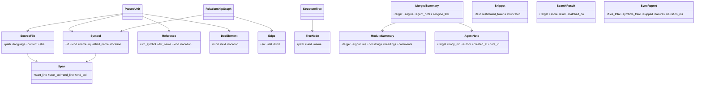

# Domain Entities — U1 Engine Core

> **단계**: CONSTRUCTION – Functional Design · **Unit: U1 Engine Core**
> **작성일**: 2026-09-08
> **원칙**: 불변(immutable) 데이터 클래스, 결정적 직렬화, LLM/I/O 미포함. 모든 엔티티는 `to_dict`/`from_dict` round-trip 대상(PBT-02).

---

## 1. 엔티티 개요 (ER 관점)

**텍스트 대안**: `ParsedUnit`는 하나의 `SourceFile`와 다수의 `Symbol`/`Reference`/`DocElement`를 가진다. `RelationshipGraph`는 `Symbol`(노드)과 `Edge`(엣지) 집합이다. `StructureTree`는 재귀적 `TreeNode` 루트를 가진다. `MergedSummary`는 하나의 엔진 `ModuleSummary`와 0..n개의 `AgentNote`를 병합해 노출한다. `Symbol`과 `SourceFile`는 위치를 `Span`으로 표현한다.

---

## 2. 엔티티 상세 명세

각 엔티티는 frozen dataclass로 구현하며 필드는 아래 순서로 직렬화한다(결정성). 컬렉션은 정렬된 상태로 저장한다.

### 2.1 Span
| 필드 | 타입 | 제약 |
|---|---|---|
| start_line | int | ≥ 1 |
| start_col | int | ≥ 0 |
| end_line | int | ≥ start_line |
| end_col | int | ≥ 0 |

- **불변식**: `(end_line, end_col) >= (start_line, start_col)`.

### 2.2 SourceFile
| 필드 | 타입 | 제약 |
|---|---|---|
| path | str | 프로젝트 루트 기준 **상대경로**, POSIX 구분자(`/`)로 정규화 |
| language | str | 파서가 판정한 언어 id(예: `python`, `markdown`); 미판정 시 `unknown` |
| content | str | UTF-8 텍스트 |
| sha | str | `content`의 SHA-256 hex(캐시/변경감지용, US-N7 AC-1) |

- **불변식**: `path`는 절대경로/`..` 미포함. `sha`는 `content`로부터 결정적으로 계산.

### 2.3 Symbol
| 필드 | 타입 | 제약 |
|---|---|---|
| id | str | `"<path>::<kind>::<qualified_name>"` (Q1=A, 결정적) |
| kind | Literal['file','function','class','method'] | |
| name | str | 단순 이름 |
| qualified_name | str | 스코프 포함 정규 이름(예: `ClassA.method_b`) |
| location | Span | 심볼 정의 위치 |

- **불변식**: `id`는 `(path, kind, qualified_name)`로 유일. 동일 파일 내 `qualified_name` 충돌 시 파서가 정규화 책임.

### 2.4 Reference
| 필드 | 타입 | 제약 |
|---|---|---|
| src_symbol | str | 참조를 발생시킨 Symbol.id |
| dst_name | str | 참조 대상의 이름(미해결 상태 가능) |
| kind | Literal['call','dependency','import'] | |
| location | Span | |

- **참고**: 이름 기반 미해결 참조. `GraphBuilder`가 심볼 테이블로 해석해 `Edge`를 만든다.

### 2.5 DocElement
| 필드 | 타입 | 제약 |
|---|---|---|
| kind | Literal['docstring','comment','heading'] | |
| text | str | 원문(정규화 전) |
| location | Span | |
| level | int \| None | heading일 때 1..6, 그 외 None |

### 2.6 ParsedUnit
| 필드 | 타입 |
|---|---|
| file | SourceFile |
| symbols | list[Symbol] (path, location 순 정렬) |
| references | list[Reference] (src_symbol, location 순 정렬) |
| doc_elements | list[DocElement] (location 순 정렬) |

### 2.7 Edge
| 필드 | 타입 | 제약 |
|---|---|---|
| src | str | Symbol.id (해결됨) |
| dst | str | Symbol.id (해결됨) |
| kind | Literal['call','dependency','import'] | |

- **불변식**: `src`, `dst`는 그래프 노드 집합에 존재. 자기순환 허용하지 않음(`src != dst`는 권장이나 재귀 호출 표현 위해 허용, 규칙은 business-rules 참조).

### 2.8 RelationshipGraph
| 필드 | 타입 |
|---|---|
| nodes | list[Symbol] (id 오름차순) |
| edges | list[Edge] ((src,dst,kind) 오름차순, 중복 제거) |

- **불변식**: 모든 `Edge.src/dst` ∈ `{node.id}`. `edges`에 중복 없음(PBT-03 대상).

### 2.9 TreeNode / StructureTree
| TreeNode 필드 | 타입 |
|---|---|
| path | str (상대경로) |
| kind | Literal['dir','file','module'] |
| name | str |
| children | list[TreeNode] (name 오름차순) |

- **StructureTree**: `{ root: TreeNode }`. 결정적 정렬로 재현성 확보(US-E4 AC-2).

### 2.10 ModuleSummary
| 필드 | 타입 | 제약 |
|---|---|---|
| target | str | 대상 식별자(파일 상대경로 또는 Symbol.id) |
| signatures | list[str] | 함수/클래스 시그니처(정렬) |
| docstrings | list[str] | 추출된 docstring |
| headings | list[str] | Markdown 헤딩(`#` 레벨 접두 유지) |
| comments | list[str] | 대표 주석(선별) |

- **불변식**: 동일 `ParsedUnit` 입력 → 동일 `ModuleSummary`(US-E3 AC-3 결정성).

### 2.11 AgentNote
| 필드 | 타입 | 제약 |
|---|---|---|
| note_id | str | `"<target>::note::<created_at>::<author>"` 결정적 id |
| target | str | 대상 식별자 |
| body_md | str | 에이전트 작성 Markdown(비어있지 않음) |
| author | str | 에이전트/세션 식별자 |
| created_at | str | ISO 8601 UTC |

- **엔진 우선 정책**: 별도 네임스페이스 저장. 재동기화 시 삭제되지 않음(FR-C1, US-A4 AC-2).

### 2.12 MergedSummary (읽기 전용 조합)
| 필드 | 타입 |
|---|---|
| target | str |
| engine | ModuleSummary \| None |
| agent_notes | list[AgentNote] (created_at 오름차순) |
| engine_first | bool = True (엔진 우선 정책 플래그, 항상 True) |

### 2.13 Snippet
| 필드 | 타입 | 제약 |
|---|---|---|
| text | str | 반환 코드/문서 스니펫 |
| estimated_tokens | int | ≥ 0, `estimate_tokens(text)`와 일치 |
| truncated | bool | 예산 초과로 축약 시 True |

- **불변식(PBT-03)**: `estimated_tokens <= token_budget` (예산 준수). `truncated=True` ⇔ 원 범위가 예산 초과.

### 2.14 SearchResult
| 필드 | 타입 | 제약 |
|---|---|---|
| target | str | Symbol.id 또는 파일 경로 |
| score | float | 0.0..1.0 |
| kind | Literal['keyword','graph'] | |
| matched_on | Literal['name','signature','doc','body','edge'] | 설명가능성 |

### 2.15 SyncReport
| 필드 | 타입 |
|---|---|
| files_total | int |
| symbols_total | int |
| skipped | list[str] (경로 + 사유) |
| failures | list[str] (경로 + 사유) |
| duration_ms | int |

---

## 3. 직렬화 계약 (PBT-02 Round-trip 대상)

- 모든 엔티티는 `to_dict(self) -> dict` / `@classmethod from_dict(cls, d) -> Self` 제공.
- **속성**: 임의 유효 인스턴스 `x`에 대해 `from_dict(to_dict(x)) == x` (PBT-02, US-N6 AC-1).
- dict 키는 필드명과 동일, 컬렉션은 위 정렬 규칙 유지 → JSON 저장 시 결정적(US-E4/N5).
- 열거형(Literal)은 문자열로 직렬화. 미지원 값 역직렬화 시 `ValueError`(business-rules 참조).

---

## 4. PBT 속성 요약 (구현은 Code Generation)

| 대상 | 속성 | 규칙 |
|---|---|---|
| 모든 엔티티 | `from_dict(to_dict(x)) == x` | PBT-02 (blocking) |
| RelationshipGraph.build | edges 중복 없음 · 모든 edge 端점 ∈ nodes | PBT-03 (blocking) |
| chunking.select_snippet | `estimated_tokens <= budget` · text 비공백(입력 비공백 시) | PBT-03 (blocking) |
| estimate_tokens | 단조 증가(긴 문자열 ≥ 짧은 문자열) · 비음수 | PBT-03 (blocking) |
