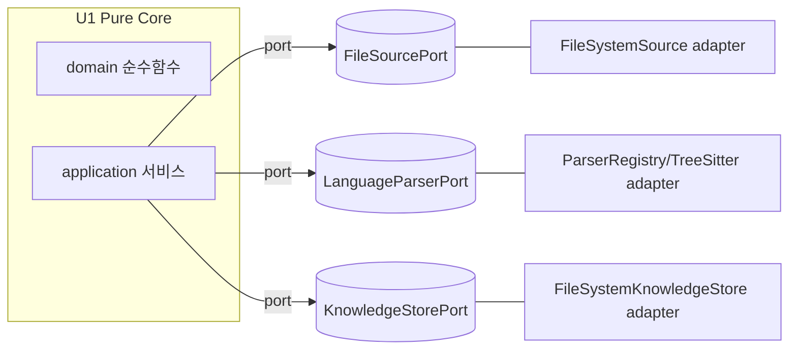

# NFR Design Patterns — U1 Engine Core

> **단계**: CONSTRUCTION – NFR Design · **Unit: U1 Engine Core** · 2026-09-08

---

## 1. 헥사고날(Ports & Adapters) — 결정성·테스트성
- **도메인/애플리케이션은 순수**: I/O(파일·파서 라이브러리)는 `FileSourcePort`/`LanguageParserPort`/`KnowledgeStorePort` 뒤로 격리.
- **효과**: 도메인 순수 함수는 부수효과 없이 PBT 대상화(PBT-02/03). NFR-C3(결정성) 구조적 보장.

**텍스트 대안**: 애플리케이션 서비스는 3개 포트(소스/파서/저장)에만 의존하고, 실제 파일시스템·tree-sitter·저장 구현은 아웃바운드 어댑터가 담당. 도메인 순수 함수는 포트조차 모른다.

## 2. 성능 패턴 (NFR-U1-P1)
- **Precompute-and-Persist**: 무거운 파싱·그래프·추출은 인제스천/동기화 시 1회 수행 후 JSON/Markdown 저장. 조회는 로드+최소 변환만 → p95 < 1s.
- **Lazy Measurement 데코레이터**: `@measure("read.summary")`로 조회 경로 소요 계측(US-N1 AC-2). 계측은 결과에 영향 없음.

## 3. 결정성 패턴 (NFR-U1-C1)
- **Immutable value objects**: frozen dataclass, 동등성은 값 기반.
- **Stable ordering**: 모든 컬렉션 직렬화 전 명시적 키 정렬(id/path/location). 해시셋 순서·삽입 순서 비의존.
- **Time isolation**: 시변 필드(created_at/duration_ms)만 시간 의존. 엔진 산출물엔 타임스탬프 배제(BR-7).

## 4. 확장성 패턴 (NFR-U1-C2)
- **Registry + Strategy**: `ParserRegistry.register(parser)` / `for_file(path)`. 새 언어는 포트 구현 등록만으로 편입(US-N4). 코어 무수정.

## 5. 신뢰성 패턴 (NFR-U1-R1/R2)
- **Error isolation (collect, don't fail-fast)**: 파일 단위 try → 실패/스킵을 `SyncReport`에 누적. (BR-1~3)
- **Null-object / Optional 조회**: 미존재 대상은 `None`/빈 리스트(BR-13). 예외 전파 없음 → 서버 무중단.

## 6. 자원/재처리 패턴 (NFR-U1-S2)
- **Content-hash skip cache**: resync 시 저장된 sha와 동일 파일 재처리 스킵(BR-12, US-N7 AC-1). 캐시는 저장소 내 sha 인덱스(파일 기반, 외부 캐시 없음).

## 7. 보안(위생) 패턴
- **Path confinement**: 모든 경로 정규화 후 프로젝트 루트 하위만 허용(BR-4). 루트 밖/`..` 거부. (최소 위생; Security Baseline opt-out)

## 8. 패턴 → NFR 추적성
| 패턴 | NFR |
|---|---|
| 헥사고날 격리 | C1, T1 |
| Precompute-and-Persist / Measure | P1 |
| Immutable + Stable ordering + Time isolation | C1, D1 |
| Registry+Strategy | C2 |
| Error isolation / Null-object | R1, R2 |
| Content-hash skip | S2 |
| Path confinement | (보안 위생) |
