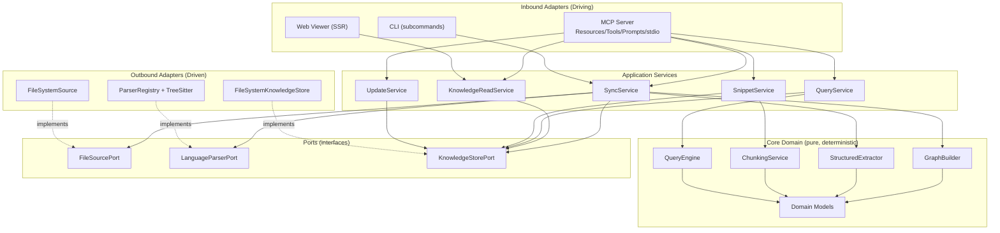

# Component Dependency — Application Design

> **프로젝트**: Agentic Knowledge Base (MCP-based)
> **단계**: INCEPTION – Application Design (Part 2: Generation)
> **작성일**: 2026-09-08
> **원칙**: 의존은 안쪽(도메인)으로 향한다. 어댑터 → 서비스 → 포트/도메인. 도메인은 무엇에도 의존하지 않는다(헥사고날, Q7=A).

---

## 1. 의존성 방향 규칙 (Dependency Rule)

- **Inbound 어댑터**(MCP/Web/CLI)는 **Application 서비스**에만 의존한다.
- **Application 서비스**는 **도메인 로직**과 **포트(추상)** 에만 의존한다.
- **Outbound 어댑터**(Parsers/Store/Source)는 **포트를 구현**한다(서비스는 구현체를 모른다 — 조립 시점에 주입).
- **도메인**(models/graph/extract/chunk/query)은 순수하며 외부 의존 없음(PBT 대상, US-N6).

---

## 2. 의존성 다이어그램 (Mermaid)



### Text Alternative (항상 포함)

```
의존 방향: Inbound 어댑터 → Application 서비스 → (도메인 로직 + 포트)
           Outbound 어댑터 → 포트 구현

Inbound Adapters:
- MCP Server   → KnowledgeReadService, QueryService, SnippetService, UpdateService, SyncService(Q5=B)
- Web Viewer   → KnowledgeReadService (Q2=A 공유)
- CLI          → SyncService

Application Services → 도메인/포트:
- SyncService            → FileSourcePort, LanguageParserPort, GraphBuilder, StructuredExtractor, KnowledgeStorePort
- KnowledgeReadService   → KnowledgeStorePort
- QueryService           → QueryEngine, KnowledgeStorePort
- SnippetService         → ChunkingService, KnowledgeStorePort
- UpdateService          → KnowledgeStorePort

Domain 로직 → Domain Models (외부 의존 없음)

Outbound Adapters (포트 구현):
- FileSystemSource         implements FileSourcePort
- ParserRegistry+TreeSitter implements LanguageParserPort
- FileSystemKnowledgeStore implements KnowledgeStorePort
```

---

## 3. 의존성 매트릭스

> 행이 열에 의존(→). A = Application, D = Domain, P = Port.

| 소비자 \ 대상 | Sync | Read | Query | Snippet | Update | Domain로직 | Ports |
|---|---|---|---|---|---|---|---|
| MCP Server | ● | ● | ● | ● | ● | | |
| Web Viewer | | ● | | | | | |
| CLI | ● | | | | | | |
| SyncService | | | | | | GraphBuilder, Extractor | Source, Parser, Store |
| KnowledgeReadService | | | | | | | Store |
| QueryService | | | | | | QueryEngine | Store |
| SnippetService | | | | | | ChunkingService | Store |
| UpdateService | | | | | | | Store |
| Outbound Adapters | | | | | | | (implements) Source/Parser/Store |

---

## 4. 통신 패턴

| 경계 | 패턴 | 비고 |
|---|---|---|
| 에이전트(P1) ↔ MCP Server | **stdio** JSON-RPC (MCP 프로토콜) | FR-A6, 로컬 프로세스 |
| 개발자(P2) ↔ Web Viewer | HTTP(로컬), **SSR** 응답 | FR-H5, 최소 의존성 |
| 개발자(P2) ↔ CLI | 프로세스 실행/표준 출력 | US-N7 규모·소요 출력 |
| 어댑터 ↔ 서비스 | 인프로세스 함수 호출(동기) | 단일 프로세스, 1초 지연 목표(NFR-P1) |
| 서비스 ↔ 포트 | **의존성 주입**(조립 시 구현체 바인딩) | 테스트/확장 용이(NFR-C2) |
| 서비스 ↔ 파일시스템 | Outbound 어댑터 경유(Markdown+JSON) | NFR-D1, 결정적 직렬화 |

---

## 5. 데이터 흐름 (Data Flow)

### 5.1 쓰기 흐름 (인제스천/재동기화)

```
소스 파일 → FileSystemSource → SourceFile
          → ParserRegistry/TreeSitter → ParsedUnit
          → GraphBuilder → RelationshipGraph
          → StructuredExtractor → ModuleSummary
          → FileSystemKnowledgeStore → Markdown+JSON (엔진 네임스페이스)
   (에이전트 노트 네임스페이스는 보존, Q6)
```

### 5.2 읽기 흐름 (에이전트/사람)

```
MCP Resource URI / Web 페이지 요청
   → KnowledgeReadService
   → FileSystemKnowledgeStore.load_*  (엔진 산출 + 에이전트 노트)
   → 병합/렌더 → 에이전트 응답(구조화) / HTML(SSR)
```

### 5.3 에이전트 노트 저장 흐름 (병행 모델)

```
에이전트 작성 심화 요약 → MCP update_tool → UpdateService(검증)
   → FileSystemKnowledgeStore.save_agent_note (별도 네임스페이스)
```

---

## 6. 순환 의존 점검

- Inbound → Application → (Domain, Ports) → (없음). **단방향, 순환 없음.**
- Outbound는 Ports를 구현할 뿐 서비스/도메인을 호출하지 않음. **순환 없음.**
- 조립(의존성 주입)은 조립 루트(`__main__`/config)에서 수행하여 컴포넌트 간 직접 결합을 피함.
