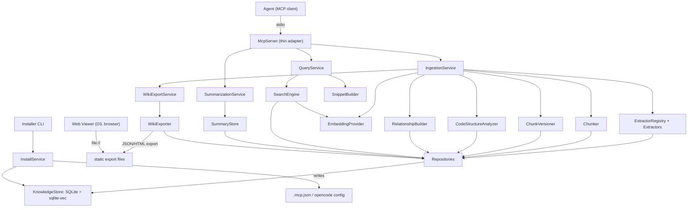

# Component Dependency — Dual-Interface Knowledge Store

**Stage**: INCEPTION → Application Design
**Rule**: dependencies flow **downward only** — Interfaces → Services → Engine components → Repositories → KnowledgeStore. The only cross-service call is `IngestionService → WikiExportService` (post-ingestion export).

---

## Dependency matrix (row depends on column)

| ↓ depends on → | McpServer | Services | Engine comps | Repositories | KnowledgeStore | EmbeddingProvider |
|---|:--:|:--:|:--:|:--:|:--:|:--:|
| **McpServer** (C1) | — | ✔ | | | | |
| **Web Viewer** (C2) | | | | | | | *(reads static export files only)* |
| **Installer** (C3) | | ✔ (InstallService) | | | ✔ (init) | |
| **IngestionService** | | ✔ (→WikiExportService) | ✔ | ✔ | | ✔ |
| **QueryService** | | — | ✔ (SearchEngine, SnippetBuilder) | ✔ | | ✔ (via SearchEngine) |
| **SummarizationService** | | — | ✔ (SummaryStore) | ✔ | | |
| **WikiExportService** | | — | ✔ (WikiExporter) | ✔ | | |
| **Engine components** | | | (peer, minimal) | ✔ | | ✔ (SearchEngine/RelBuilder) |
| **Repositories** (C15) | | | | — | ✔ | |

Legend: ✔ = direct dependency; blank = none.

---

## Communication patterns

| Boundary | Mechanism | Notes |
|---|---|---|
| Agent ↔ McpServer | **MCP over stdio** | External process boundary; self-describing tools/resources (NFR-5). |
| McpServer ↔ Services | In-process Python method calls | Thin adapter; typed args in, `ToolResult` out. |
| Services ↔ Components ↔ Repositories | In-process synchronous calls | Typed result objects (Q7). |
| Repositories ↔ KnowledgeStore | SQLite driver + sqlite-vec | All SQL isolated in repositories (Q4). |
| WikiExportService → export files | File writes (JSON/HTML) | Into `<target>/.knowledge-store/wiki/`. |
| Web Viewer ← export files | `file://` static load (Q8) | No runtime server; decoupled from engine. |
| Installer ↔ MCP client configs | File writes (`.mcp.json`/opencode) | Auto-config or README fallback (US-8.3). |

**Coupling notes**: The Web Viewer is fully **decoupled** from the engine — it depends only on the static export contract, not on any Python component. This satisfies "static HTML + D3, no build tools" and keeps the human interface independent of server availability.

---

## Data-flow diagram (Mermaid)



### Text alternative (data flow)

```
Agent --stdio--> McpServer --> { IngestionService, QueryService, SummarizationService }

IngestionService -> Extractors -> Chunker -> ChunkVersioner -> CodeStructureAnalyzer
                 -> EmbeddingProvider -> RelationshipBuilder -> Repositories
                 -> (post-step) WikiExportService -> WikiExporter -> static export files

QueryService -> SearchEngine (-> EmbeddingProvider) / SnippetBuilder -> Repositories
SummarizationService -> SummaryStore -> Repositories

Repositories -> KnowledgeStore (SQLite + sqlite-vec, in <target>/.knowledge-store/)

Web Viewer (browser) --file://--> static export files   [decoupled from engine]
Installer CLI -> InstallService -> KnowledgeStore.init + writes .mcp.json/opencode config
```

---

## Build-order implication (input to Units Generation)
A natural dependency-respecting order (to be finalized in Units Generation):
1. KnowledgeStore + Repositories (foundation)
2. EmbeddingProvider
3. Extractors + Chunker (+ ChunkVersioner)
4. CodeStructureAnalyzer
5. RelationshipBuilder + SearchEngine + SnippetBuilder
6. SummaryStore
7. Services (Ingestion, Query, Summarization, WikiExport)
8. McpServer (thin adapter over services)
9. WikiExporter + Web Viewer (consumes export contract)
10. InstallService + Installer CLI
