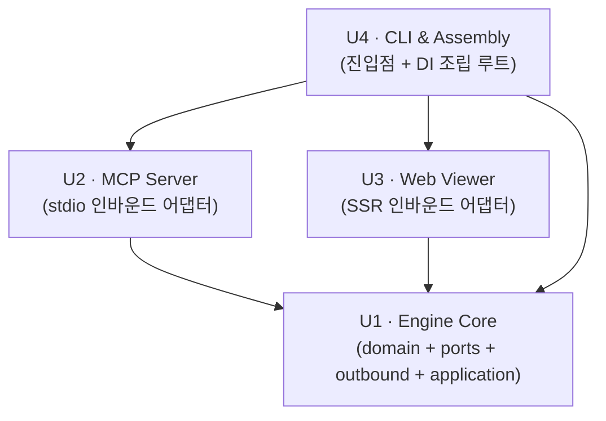

# Unit of Work — 의존성 매트릭스

> **프로젝트**: Agentic Knowledge Base (MCP-based)
> **단계**: INCEPTION – Units Generation (Part 2: Generation)
> **작성일**: 2026-09-08
> **원칙**: 의존은 안쪽(코어 U1)으로 향한다. 어댑터/조립 Unit → 코어 Unit. 코어는 어느 Unit에도 의존하지 않는다(헥사고날).

---

## 1. Unit 의존성 다이어그램 (Mermaid)



### Text Alternative (항상 포함)

```
의존 방향 (행 → 열, 행이 열에 의존):

- U1 Engine Core     → (없음)                 # leaf, 자립
- U2 MCP Server      → U1                      # U1 Application 서비스 노출
- U3 Web Viewer      → U1                      # U1 KnowledgeReadService 노출
- U4 CLI & Assembly  → U1, U2, U3              # 전 Unit 조립·기동(DI 조립 루트)

그래프 형태: 방향성 비순환 그래프(DAG). U1이 최하위(leaf).
개발/조립 순서: U1 → U2 → U3 → U4.
```

---

## 2. 의존성 매트릭스

> 행이 열에 의존하면 ●. 대각선(자기 자신)은 —.

| 소비 Unit \ 대상 Unit | U1 Engine Core | U2 MCP Server | U3 Web Viewer | U4 CLI & Assembly |
|---|---|---|---|---|
| **U1 Engine Core** | — | | | |
| **U2 MCP Server** | ● | — | | |
| **U3 Web Viewer** | ● | | — | |
| **U4 CLI & Assembly** | ● | ● | ● | — |

- **역방향(피의존) 요약**: U1은 U2·U3·U4에 피의존(3). U2·U3는 U4에 피의존(1). U4는 피의존 없음(최종 조립 지점).
- **팬인 최대**: U1(가장 재사용되는 코어) → U1을 가장 먼저·견고하게 완성해야 함(개발 순서 근거).

---

## 3. Unit 간 결합 계약 (Coupling Contracts)

| 경계 | 결합 대상(무엇에 의존하는가) | 통신 패턴 | 비고 |
|---|---|---|---|
| U2 → U1 | Application 서비스 인터페이스(Read/Query/Snippet/Update/Sync) | 인프로세스 동기 함수 호출 | MCP는 위임만, 로직 미보유 |
| U3 → U1 | KnowledgeReadService 인터페이스 | 인프로세스 동기 함수 호출 | SSR 렌더에 필요한 읽기 파사드 |
| U4 → U1 | 포트/서비스 구체 구현 바인딩 | DI 조립(구현체 주입) | `config.py`/`__main__.py`에서만 구현체 선택 |
| U4 → U2 | MCP 서버 부트스트랩 진입점 | `serve-mcp` 서브커맨드 조립 | stdio 전송 기동 |
| U4 → U3 | Web 서버 부트스트랩 진입점 | `serve-web` 서브커맨드 조립 | 로컬 HTTP 기동 |

> **의존성 역전(DIP)**: U1의 서비스는 포트 추상에만 의존하고 아웃바운드 구현체(FileSystem/TreeSitter)를 모른다. 실제 바인딩은 U4 조립 루트에서 수행 → Unit 간 직접 결합 회피.

---

## 4. 순환 의존 점검

- U1은 다른 Unit을 참조하지 않음(leaf). ✔
- U2, U3는 U1만 참조. ✔
- U4는 U1/U2/U3를 참조하나, U1/U2/U3 중 어느 것도 U4를 참조하지 않음. ✔
- **결론: 순환 없음(DAG). Unit 경계 유효.**

---

## 5. 개발/통합 순서에 대한 함의

1. **U1 Engine Core** — 의존 없음. 도메인·포트·아웃바운드·서비스를 완성하고 PBT(US-N6) 포함 자체 검증.
2. **U2 MCP Server** — U1 서비스 위에 stdio MCP 표면 추가.
3. **U3 Web Viewer** — U1 읽기 서비스 위에 SSR 표면 추가.
4. **U4 CLI & Assembly** — 전 Unit을 DI로 조립, 서브커맨드 진입점 제공(마지막 통합 지점).
5. **Build & Test** — 조립 완료 후 Unit 간 통합/성능/(부분)PBT 실행.
