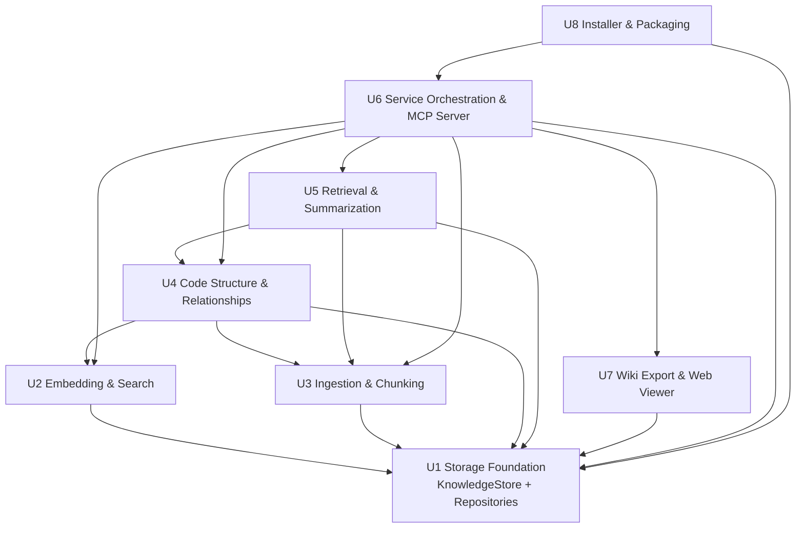

# Unit of Work Dependency — Dual-Interface Knowledge Store

**Stage**: INCEPTION → Units Generation (Part 2)
**Rule**: dependencies flow **downward only** (Interfaces → Services → Engine → Repositories → Store). All inter-unit communication is **in-process typed interface calls**. The single sanctioned cross-orchestration call is **U6 IngestionService → U7 WikiExporter** (post-ingestion export).

---

## Dependency matrix (row depends on column)

| ↓ depends on → | U1 Store | U2 Embed/Search | U3 Ingest/Chunk | U4 CodeGraph/Rel | U5 Retrieval/Summary | U6 Services/MCP | U7 Wiki/Viewer | U8 Installer |
|---|:--:|:--:|:--:|:--:|:--:|:--:|:--:|:--:|
| **U1 Storage Foundation** | — | | | | | | | |
| **U2 Embedding & Search** | ✔ | — | | | | | | |
| **U3 Ingestion & Chunking** | ✔ | | — | | | | | |
| **U4 Code Structure & Relationships** | ✔ | ✔ | ✔ | — | | | | |
| **U5 Retrieval & Summarization** | ✔ | | ✔ | ✔ | — | | | |
| **U6 Service Orchestration & MCP** | ✔ | ✔ | ✔ | ✔ | ✔ | — | ✔ (WikiExporter iface) | |
| **U7 Wiki Export & Viewer** | ✔ (exporter reads repos) | | | | | | — | |
| **U8 Installer & Packaging** | ✔ (init_schema) | | | | | ✔ (MCP entry point) | | — |

Legend: ✔ = direct dependency; blank = none. Viewer front-end within U7 depends only on the static-export file contract (decoupled from all Python units).

---

## Dependency graph (Mermaid)



### Text alternative (dependencies)
```
U1 Storage Foundation ......... depends on: (none)
U2 Embedding & Search ......... depends on: U1
U3 Ingestion & Chunking ....... depends on: U1
U4 Code Structure & Rel ....... depends on: U1, U2, U3
U5 Retrieval & Summarization .. depends on: U1, U3, U4
U7 Wiki Export & Viewer ....... depends on: U1 (exporter); viewer front-end = export-file contract only
U6 Service Orchestration+MCP .. depends on: U1, U2, U3, U4, U5, U7
U8 Installer & Packaging ...... depends on: U1, U6
```

---

## Recommended build order

1. **U1 Storage Foundation** — schema + repositories; unblocks everything.
2. **U2 Embedding & Search** — needs U1.
3. **U3 Ingestion & Chunking** — needs U1; feeds U4/U5. (PBT-heavy — chunk round-trip, versioner determinism.)
4. **U4 Code Structure & Relationships** — needs U1/U2/U3.
5. **U5 Retrieval & Summarization** — needs U1/U3/U4.
6. **U7 Wiki Export & Web Viewer** — exporter core needs U1; fixes the static-export contract early so the viewer (independent) can follow.
7. **U6 Service Orchestration & MCP Server** — top of the stack; wires U1–U5 + U7 exporter; exposes MCP over stdio.
8. **U8 Installer & Packaging** — needs U1 (init) + U6 (MCP entry point); last, integrates the whole package.

**No cycles**: the graph is a DAG. The only cross-orchestration edge (U6→U7) is interface-mediated and one-directional.
