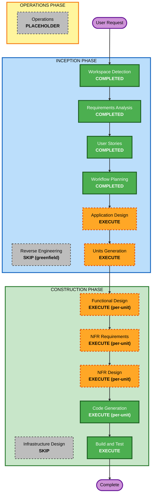

# Execution Plan — TRACE

**단계**: INCEPTION / Workflow Planning
**작성일**: 2026-09-08
**프로젝트 유형**: Greenfield

## Detailed Analysis Summary

### Change Impact Assessment
- **User-facing changes**: Yes — 3 페르소나가 Claude Code(에이전트) 경유로 5개 MCP 도구와 상호작용
- **Structural changes**: Yes — 신규 시스템 아키텍처(MCP 서버 / 로컬 엔진 / AI 워크플로우 / 지식 저장) 정의 필요
- **Data model changes**: Yes — Feature / Claim / Evidence / Conflict / Impact 신규 데이터 모델
- **API changes**: Yes — 5개 MCP 도구 계약 + 리소스/프롬프트 (신규)
- **NFR impact**: Yes — 그라운딩·환각 처리·시크릿·로깅·시연 안정성 + PBT 전면·Resiliency 확장

### Risk Assessment
- **Risk Level**: Medium — 신규 greenfield PoC, 로컬 단일 프로세스라 롤백 쉬움. 다만 AI 워크플로우 신뢰성/시연 안정성이 핵심 불확실성
- **Rollback Complexity**: Easy — 로컬 프로세스, 상태는 파일(knowledge/) 기반
- **Testing Complexity**: Moderate — PBT 전면 적용, AI 출력 결정성/폴백 테스트 필요

## Workflow Visualization

## Phases to Execute

### 🔵 INCEPTION PHASE
- [x] Workspace Detection (COMPLETED)
- [x] Reverse Engineering (SKIPPED — greenfield, 기존 코드 없음)
- [x] Requirements Analysis (COMPLETED)
- [x] User Stories (COMPLETED)
- [x] Execution Plan (IN PROGRESS)
- [ ] Application Design — **EXECUTE**
  - **Rationale**: 신규 컴포넌트 4계층(MCP 인터페이스/로컬 엔진/AI 워크플로우/지식 저장)과 코어 함수 인터페이스, 컴포넌트 의존성을 정의해야 함. NFR-CORE-001/002(코어·인터페이스 분리, 재사용) 충족의 출발점.
- [ ] Units Generation — **EXECUTE**
  - **Rationale**: 시스템이 UOW-01~06으로 자연 분해됨. 각 유닛 단위로 구성/코드 생성을 순차 진행하기 위해 필요.

### 🟢 CONSTRUCTION PHASE (per-unit loop, UOW별 반복)
- [ ] Functional Design — **EXECUTE (per-unit)**
  - **Rationale**: 신규 데이터 모델(Claim/Evidence/Conflict/Feature)과 복잡한 비즈니스 로직(정규화·값 비교·영향 분류). **PBT-01**(설계 시 테스트 속성 식별)은 이 단계에서 필수.
- [ ] NFR Requirements — **EXECUTE (per-unit)**
  - **Rationale**: 성능/시크릿/로깅/시연 안정성 NFR + 기술 스택 확정(파서 라이브러리, **Hypothesis(PBT-09)**). 확장 요구사항 반영.
- [ ] NFR Design — **EXECUTE (per-unit)**
  - **Rationale**: 그라운딩·환각 처리·폴백 패턴, Resiliency 확장 준수(대부분 인프라 룰 N/A 명시), 프롬프트 분리 설계.
- [ ] Infrastructure Design — **SKIP**
  - **Rationale**: 로컬 stdio 단일 프로세스 PoC. 클라우드 리소스·배포 인프라·멀티존/리전 없음(RTO/RPO=N/A, Q11=E). Resiliency 인프라 룰(RESILIENCY-08~13)은 N/A. 패키징·진입점은 Code Generation에서 처리. *필요 시 사용자가 포함 요청 가능.*
- [ ] Code Generation — **EXECUTE (ALWAYS, per-unit)**
  - **Rationale**: 실제 구현. PBT + 예제 테스트 동반 생성.
- [ ] Build and Test — **EXECUTE (ALWAYS)**
  - **Rationale**: 빌드·유닛/통합/PBT 실행·Hero E2E 검증·시연 스크린샷.

### 🟡 OPERATIONS PHASE
- [ ] Operations — PLACEHOLDER

## Units 개요 (Units Generation 입력)
UOW-01 스캐너/파서 · UOW-02 Feature/지식 · UOW-03 Claim/Evidence/Conflict · UOW-04 Task Impact · UOW-05 MCP 인터페이스 · UOW-06 통합/신뢰성/시연

**권장 구현 순서(의존성 기준)**: UOW-01 → UOW-02 → UOW-03 → UOW-04 → UOW-05 → UOW-06
(스캔/파싱이 지식의 입력, 지식이 Claim/Conflict의 기반, 그 위에 Impact, 이들을 MCP로 노출, 마지막에 통합·시연)

## Estimated Timeline
- **Total Phases (execute)**: INCEPTION 2(AD, UG) + CONSTRUCTION per-unit(FD/NFRA/NFRD/CG × 6 UOW) + Build&Test
- **Estimated Duration**: 2일 해커톤 PoC 범위. P0 우선, P1은 시간 허용 시.

## Success Criteria
- **Primary Goal**: Hero 시나리오("Owner 등록에 SMS 인증 추가")를 Claude Code에서 E2E로 시연 — 충돌 경고 + 근거 기반 Change Plan
- **Key Deliverables**: Python MCP 서버(5 도구+리소스), 로컬 엔진/AI 워크플로우, knowledge/features/*.md, 폴백 CLI, README 턴키 구성, `result/` 스크린샷
- **Quality Gates**: DoD(§20) 충족, PBT+예제 테스트 통과, 하드코딩 시크릿 없음, 코어/인터페이스 분리, Hero 반복 가능
