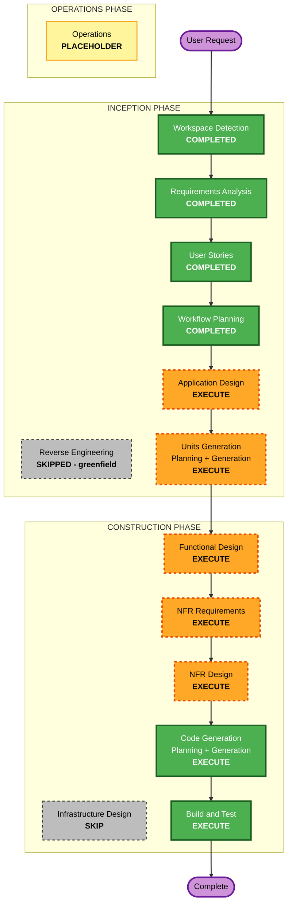

# Execution Plan

> **프로젝트**: Agentic Knowledge Base (MCP-based)
> **단계**: INCEPTION – Workflow Planning
> **작성일**: 2026-09-08
> **프로젝트 유형**: Greenfield (브라운필드 전용 섹션은 N/A)
> **입력 산출물**: `requirements.md`, `stories.md`, `personas.md`

---

## 1. 상세 분석 요약 (Detailed Analysis Summary)

### 1.1 Transformation Scope (Brownfield Only)
- **N/A** — 그린필드 신규 프로젝트.

### 1.2 Change Impact Assessment
| 영역 | 영향 | 설명 |
|---|---|---|
| **User-facing changes** | Yes | 에이전트용 MCP 인터페이스(Resources/Tools/Prompts) + 사람용 경량 웹 뷰어 신규 구축 |
| **Structural changes** | Yes | 3개 서브시스템(MCP Server, Knowledge Engine, Web Viewer) 신규 아키텍처 |
| **Data model changes** | Yes | 코드 관계 그래프 스키마, 구조/요약 지식 산출물(Markdown+JSON) 모델 신규 정의 |
| **API changes** | Yes | MCP Resource URI 스킴 및 Tool 입출력 스키마(계약) 신규 정의 |
| **NFR impact** | Yes | 조회 응답 1초(NFR-P1), 토큰 효율(NFR-P2), 파서 확장성(NFR-C2), 엔진 로컬성/결정성(NFR-C3), PBT(NFR-T*) |

### 1.3 Component Relationships (Brownfield Only)
- **N/A** — 그린필드.

### 1.4 Risk Assessment
- **Risk Level**: **Medium** — 다중 서브시스템·에이전트-엔진 상호작용·그래프 분석으로 구조적 복잡도는 있으나, 로컬 단일 사용자 PoC 성격이라 영향 범위가 로컬에 한정되고 롤백이 용이.
- **Rollback Complexity**: Easy — 파일 기반·Git 친화 산출물, 로컬 환경.
- **Testing Complexity**: Moderate — 순수 함수/직렬화 round-trip PBT + 기능 테스트, MCP/뷰어 통합 테스트.

---

## 2. Workflow Visualization

### Mermaid Diagram



### Text Alternative (항상 포함)

```
🔵 INCEPTION PHASE
- Workspace Detection ....... COMPLETED
- Reverse Engineering ....... SKIPPED (greenfield)
- Requirements Analysis ..... COMPLETED
- User Stories .............. COMPLETED
- Workflow Planning ......... COMPLETED (current)
- Application Design ........ EXECUTE
- Units Generation .......... EXECUTE

🟢 CONSTRUCTION PHASE (per-unit loop, then build/test)
- Functional Design ......... EXECUTE (per-unit)
- NFR Requirements .......... EXECUTE (per-unit)
- NFR Design ................ EXECUTE (per-unit)
- Infrastructure Design ..... SKIP    (per-unit)
- Code Generation ........... EXECUTE (per-unit, ALWAYS)
- Build and Test ............ EXECUTE (ALWAYS)

🟡 OPERATIONS PHASE
- Operations ................ PLACEHOLDER
```

---

## 3. Phases to Execute

### 🔵 INCEPTION PHASE
- [x] Workspace Detection (COMPLETED)
- [x] Reverse Engineering (SKIPPED — greenfield)
- [x] Requirements Analysis (COMPLETED)
- [x] User Stories (COMPLETED)
- [x] Workflow Planning (IN PROGRESS → 승인 시 COMPLETED)
- [ ] Application Design — **EXECUTE**
  - **Rationale**: 신규 3개 서브시스템(MCP Server, Knowledge Engine, Web Viewer)의 컴포넌트·메서드·서비스 경계와 의존성을 정의해야 함.
- [ ] Units Generation — **EXECUTE**
  - **Rationale**: 시스템을 다수의 작업 단위(서브시스템/모듈 + 교차관심사)로 분해해야 함. 복잡도가 단일 유닛으로 처리하기에 큼.

### 🟢 CONSTRUCTION PHASE (각 Unit별 반복)
- [ ] Functional Design — **EXECUTE** (per-unit)
  - **Rationale**: 코드 관계 그래프 스키마, 지식 산출물(Markdown+JSON) 데이터 모델, 결정적 구조 추출/청킹 등 복잡 비즈니스 로직 설계 필요.
- [ ] NFR Requirements — **EXECUTE** (per-unit)
  - **Rationale**: 조회 응답 1초, 토큰 효율, 파서 확장성, 엔진 결정성; 미확정 기술 스택(PBT 프레임워크, 경량 SSR) 선정 필요.
- [ ] NFR Design — **EXECUTE** (per-unit)
  - **Rationale**: NFR Requirements가 실행되므로 대응 설계 패턴(캐싱/청킹/결정적 직렬화 등) 반영 필요.
- [ ] Infrastructure Design — **SKIP** (per-unit)
  - **Rationale**: 로컬 단일 사용자 환경, stdio 전송, 파일 기반 저장으로 클라우드/배포/네트워킹 인프라가 없음. (로컬 패키징/실행 설정은 Code Generation에서 처리) — *사용자가 원하면 포함 가능.*
- [ ] Code Generation — **EXECUTE** (ALWAYS, per-unit)
  - **Rationale**: 구현 계획 및 코드/테스트 생성 필요.
- [ ] Build and Test — **EXECUTE** (ALWAYS)
  - **Rationale**: 빌드·단위/통합/PBT 테스트 및 검증 필요.

### 🟡 OPERATIONS PHASE
- [ ] Operations — **PLACEHOLDER**
  - **Rationale**: 향후 배포/모니터링 워크플로용 자리표시자.

---

## 4. Package Change Sequence (Brownfield Only)
- **N/A** — 그린필드. Unit 순서/의존성은 Units Generation 단계에서 산출한다.

---

## 5. Estimated Timeline
- **Total Stages to Execute**: 인셉션 2개(AD, UG) + 컨스트럭션 per-unit(FD/NFRA/NFRD/CG) × Unit 수 + Build and Test 1개.
- **Estimated Duration**: Unit 수에 따라 가변 (Units Generation에서 확정). 반복적 대화형 진행.

## 6. Success Criteria
- **Primary Goal**: 에이전트용 MCP 서버(stdio) + 사람용 경량 웹 뷰어 + LLM 미호출·결정적 Knowledge Engine으로 구성된 MVP 지식 베이스 구축.
- **Key Deliverables**: MCP Resources/Tools/Prompts, 코드 그래프 엔진, 파일 기반 지식 저장/재동기화, 기본 웹 뷰어.
- **Quality Gates**: 조회 응답 1초 목표, 토큰 효율, 순수함수/직렬화 round-trip PBT(PBT-02/03/07/08/09) 통과, INVEST 스토리 인수 기준 충족.
