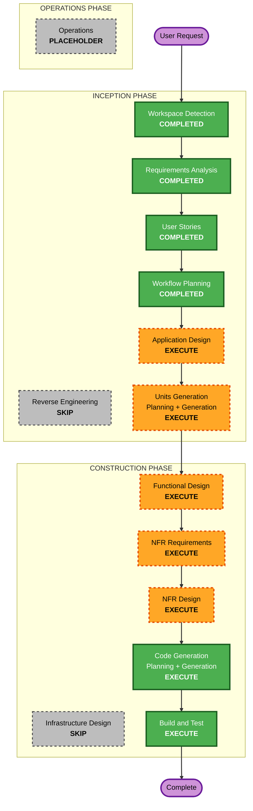

# Execution Plan — Dual-Interface Knowledge Store

**Project Type**: Greenfield
**Prior context**: `requirements.md`, `stories.md` (9 Epics / 28 stories), `personas.md` (P1 Agent, P2 Reviewer, P3 Installer)

## Detailed Analysis Summary

### Transformation Scope
- **Greenfield** — no existing codebase; brownfield transformation analysis is **N/A**.

### Change Impact Assessment
- **User-facing changes**: **Yes** — two first-class interfaces (MCP Agent tools/resources over stdio; static HTML + D3 human wiki viewer).
- **Structural changes**: **Yes** — new multi-component system (MCP Server, Knowledge Engine, Web Viewer, Installer).
- **Data model changes**: **Yes** — new SQLite + sqlite-vec schema (chunks, code graph nodes/edges, relationships, chunk versions, embeddings, summaries).
- **API changes**: **Yes** — new MCP Resources + Tools contract (Semantic Query, Smart Snippet, Ingestion/Update).
- **NFR impact**: **Yes** — latency (NFR-1.1, 1s target), token efficiency (NFR-1.2), local-only/LLM-free cost (NFR-3), installability (NFR-4), discoverability (NFR-5), PBT Partial (NFR-8).

### Risk Assessment
- **Risk Level**: **Medium–High** — multiple interacting components, tree-sitter multi-language parsing, graph modeling, local embedding, chunk versioning heuristics.
- **Rollback Complexity**: Easy — greenfield, local embedded store; data isolated in `.knowledge-store/`.
- **Testing Complexity**: Moderate–Complex — deterministic pipelines lend themselves to PBT (chunking round-trips, hash matching determinism), plus MCP integration tests and viewer checks.

## Workflow Visualization

### Mermaid Diagram



### Text Alternative (always included)

```
🔵 INCEPTION PHASE
- Workspace Detection ....... COMPLETED
- Reverse Engineering ....... SKIP (greenfield, no existing code)
- Requirements Analysis ..... COMPLETED
- User Stories .............. COMPLETED
- Workflow Planning ......... COMPLETED (this stage)
- Application Design ........ EXECUTE
- Units Generation .......... EXECUTE

🟢 CONSTRUCTION PHASE (per-unit loop for each unit)
- Functional Design ......... EXECUTE (per unit)
- NFR Requirements .......... EXECUTE (per unit)
- NFR Design ................ EXECUTE (per unit)
- Infrastructure Design ..... SKIP (local, LLM-free, no cloud infra)
- Code Generation ........... EXECUTE (per unit, ALWAYS)
- Build and Test ............ EXECUTE (ALWAYS, after all units)

🟡 OPERATIONS PHASE
- Operations ................ PLACEHOLDER
```

## Phases to Execute

### 🔵 INCEPTION PHASE
- [x] Workspace Detection (COMPLETED)
- [x] Reverse Engineering (SKIPPED — greenfield)
- [x] Requirements Analysis (COMPLETED)
- [x] User Stories (COMPLETED)
- [x] Workflow Planning (IN PROGRESS → completing)
- [ ] Application Design — **EXECUTE**
  - **Rationale**: Multiple new components/services (MCP Server, Knowledge Engine, Web Viewer, Installer) with methods, business rules (chunking, 3-way relationship construction, versioning), and inter-component dependencies that need explicit definition.
- [ ] Units Generation — **EXECUTE**
  - **Rationale**: Complex system requiring decomposition into multiple units of work (e.g., Ingestion/Chunking, Code Structure/Graph, Relationship Construction, Chunk Versioning, Embedding/Search Store, MCP Server, Web Viewer, Installer) with dependencies and story mapping.

### 🟢 CONSTRUCTION PHASE (per-unit)
- [ ] Functional Design — **EXECUTE** (per unit)
  - **Rationale**: New data models/schemas (SQLite + sqlite-vec) and complex business logic (semantic chunking, symbol resolution, similarity/hash versioning, token-budgeted snippets) require detailed design.
- [ ] NFR Requirements — **EXECUTE** (per unit)
  - **Rationale**: Explicit performance targets (1s latency, token efficiency), tech-stack selection (Python, Hypothesis, sqlite-vec, local embedding model), and PBT Partial extension obligations (PBT-02/03/07/08/09) must be captured per unit.
- [ ] NFR Design — **EXECUTE** (per unit)
  - **Rationale**: NFR Requirements is executing; latency/token/PBT/installability patterns must be incorporated into the design.
- [ ] Infrastructure Design — **SKIP**
  - **Rationale**: System is local, file-system-based, LLM-free with an embedded SQLite + sqlite-vec store — **no cloud resources, servers, or deployment infrastructure to map**. Installation is a copy-style script + MCP config auto-add, handled as a code unit (Installer) with Functional Design coverage and documented in README. *(User may re-include this stage if desired.)*
- [ ] Code Generation — **EXECUTE** (ALWAYS, per unit)
  - **Rationale**: Implementation planning and code generation are required for each unit.
- [ ] Build and Test — **EXECUTE** (ALWAYS)
  - **Rationale**: Build, unit/integration/PBT tests, and verification across all units.

### 🟡 OPERATIONS PHASE
- [ ] Operations — **PLACEHOLDER**
  - **Rationale**: Future deployment/monitoring workflows; not active in current workflow.

## Package Change Sequence
- N/A (greenfield). Unit build order will be established in Units Generation via unit dependency mapping.

## Estimated Timeline
- **Total active stages**: 2 remaining INCEPTION (Application Design, Units Generation) + per-unit CONSTRUCTION loop (Functional Design, NFR Requirements, NFR Design, Code Generation) across the generated units + Build and Test.
- **Estimated duration**: Multi-session, iterative — each unit fully designed and coded before the next; Build and Test after all units.

## Success Criteria
- **Primary Goal**: A working, easily-installable, LLM-free MCP knowledge store with a token-efficient Agent interface and a human D3 wiki viewer.
- **Key Deliverables**: MCP Server (stdio), Ingestion/Chunking + tree-sitter code graph, 3-way relationship construction, chunk versioning, local embedding + sqlite-vec search, static HTML+D3 viewer, copy-style installer + auto MCP config + Agent-readable README.
- **Quality Gates**: All 28 stories' acceptance criteria satisfied; PBT Partial rules (PBT-02/03/07/08/09) enforced on chunking/serialization/parsing/hash-matching; licensing notices preserved for Graphify/obsidian-wiki ported code (NFR-7).
