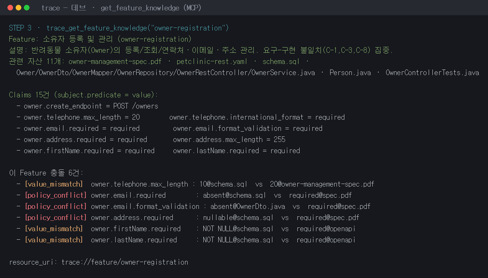

# 데브(Understand) — 낯선 코드베이스, 하루 만에 근거로 이해하기

> 이 문서는 **데브** 페르소나가 TRACE를 사용해 실제 업무를 성공적으로 수행하는 과정을
> 순차적으로 기록한 시나리오다. 각 단계의 **자연어 요청 → 호출된 MCP tool → 실제 작업 화면
> (콘솔 출력 원문) → 데브가 읽어낸 것 / 다음 행동** 순으로 이어진다.
>
> **이 판의 작업 화면은 실제 Claude(Amazon Bedrock, `global.anthropic.claude-opus-4-8`)로
> 라이브 추출한 결과다.** 스캔·파싱·지식 저장·충돌 검출은 실제 코어 코드가, Feature/Claim 추출은
> 실제 opus가 수행했다. 실제 LLM 출력이므로 **비결정적**이다 — Feature 제목·Claim 문구·충돌
> 개수가 실행마다 달라질 수 있다.
>
> - **라이브 재현**: `python demo/tools/extract_features_live.py` (Bedrock 자격증명 필요, `.env` 참고)
> - **API 키 없이 결정적 재현**: `python demo/scenario/dev/capture_dev_scenario.py` (FakeLLM, 매번 동일)

<p align="center">
  <br/>
  <sub>시연 스크린샷 · STEP 3 <code>get_feature_knowledge("owner-registration")</code> 실제 출력</sub>
</p>

---

## 👤 업무 명세 (Task Spec)

| 항목 | 내용 |
|---|---|
| **누가** | 데브 — 이번 주에 petclinic 팀에 합류한 개발자. 코드베이스가 낯설다. |
| **핵심 질문** | *"이 프로젝트에 뭐가 있고, 내가 곧 손댈 Owner 등록 기능은 어떻게 동작하지? 어디를 바꿔야 하지?"* |
| **언제·빈도** | 새 프로젝트/팀에 투입된 **첫 며칠**, 그리고 기능을 건드리기 전마다. |
| **주어진 것** | 5개 도메인(Owner/Pet/Vet/Visit/Billing)에 걸친 **48개 자산** — 요구사항 PDF·OpenAPI·DB 스키마·Java 소스·설정·테스트가 폴더별로 흩어져 있음. |
| **성공 기준** | 파일을 일일이 열어 머릿속으로 조립하지 않고, **Feature 단위로 재구성된 지식 + 각 사실의 근거(Evidence)**를 확보한다. 곧 손댈 기능에 이미 어긋난 지점이 있으면 착수 전에 안다. |

**TRACE 없이는**: 48개 파일을 직접 열어(`requirements/*.pdf`, `openapi/*.yaml`, `db/schema.sql`,
`src/**/*.java`, `config/*`, `tests/*`) Feature 경계를 스스로 그리고, 문서와 코드가 맞는지 눈으로
대조해야 한다. 온보딩이 며칠씩 걸리고, telephone 길이가 스펙엔 20인데 코드엔 10이라는 사실 같은 건
대부분 놓친 채 개발에 들어간다.

**데브의 도구 흐름**: `trace_analyze_project` → `trace_list_features` →
`trace_get_feature_knowledge("owner-registration")` → 지식 본문 리소스 조회.

---

## STEP 1 — 프로젝트를 통째로 지식화한다

**자연어 요청 (Claude Code)**
```
이 프로젝트를 분석해줘.
```

**호출된 tool**: `trace_analyze_project`
(스캔 → Feature 식별 → Claim/Evidence 추출 → 결정적 충돌 검출 → 지식 저장)

**실제 작업 화면** (Bedrock opus 라이브)
```text
실제 Claude 로 demo/ 분석 중… (비결정적, 네트워크 호출)
⚠ 충돌 39건이 감지되었습니다 (아래 우선 확인).
6개 Feature 분석 완료 (자산 48개, 충돌 39건)
자산 48개 / Feature 6개 / 충돌 39건
```

**데브가 읽어낸 것**
- 흩어져 있던 **48개 자산**이 한 번의 호출로 **6개 Feature**로 재구성됐다.
- 시작부터 다수의 문서-구현 충돌이 경고로 떠서, "일단 코드부터 읽자"가 아니라 "무엇이 어긋나
  있는지부터 보자"로 방향이 잡힌다.
- 이후 조회(STEP 2~4)는 저장된 지식을 읽으므로 **LLM 재호출 없이** 즉시 응답한다.

> ℹ️ 큐레이션된 결정적 데모(FakeLLM)는 정확히 **9건**의 충돌을 심어 두었지만, 실제 opus는 훨씬
> 공격적으로 Claim을 추출해 이 실행에서 **39건**을 검출했다(예: `NOT NULL` vs `required` 같은
> 미묘한 표현 차이까지 불일치로 표면화). 라이브는 재현마다 개수·문구가 달라진다 — 그래서 회귀
> 검증용으로는 결정적 모드를, 실제 위력 시연용으로는 라이브 모드를 쓴다.

---

## STEP 2 — 무슨 기능들이 있는지 지도를 본다

**자연어 요청**
```
어떤 기능들이 있는지 목록으로 보여줘.
```

**호출된 tool**: `trace_list_features` (저장된 지식만 읽음, LLM 미호출)

**실제 작업 화면** (Bedrock opus 라이브)
```text
  - billing-invoicing: 청구 및 인보이스 (충돌 6건)
  - clinic-configuration: 클리닉 설정 및 세금 정책 (충돌 1건)
  - owner-registration: 소유자 등록 및 관리 (충돌 6건)
  - pet-management: 반려동물 관리 (충돌 10건)
  - vet-directory: 수의사 디렉터리 (충돌 9건)
  - visit-scheduling: 진료 방문 예약 (충돌 7건)
```

**데브가 읽어낸 것**
- 코드베이스의 **기능 지도**가 한눈에 들어온다. 폴더 구조가 아니라 **의미 단위(Feature)**이고,
  opus가 붙인 한국어 제목·요약이 그대로 온다.
- 곧 손댈 **`owner-registration`에 충돌이 6건**. 어디를 먼저 깊게 봐야 하는지 신호가 잡히고,
  다음 단계 대상이 자연스럽게 정해진다.

---

## STEP 3 — 손댈 기능을 근거와 함께 파고든다

**자연어 요청**
```
Owner 등록 기능이 어떻게 동작하는지 근거와 함께 설명해줘.
```

**호출된 tool**: `trace_get_feature_knowledge("owner-registration")`

**실제 작업 화면** (Bedrock opus 라이브)
```text
Feature: 소유자 등록 및 관리 (owner-registration)
설명: 반려동물 소유자(Owner)의 등록, 조회, 연락처/주소/이메일 등 개인정보 관리를 담당하는 기능.
      전화번호 길이, 이메일 필수 여부, 주소 필수 여부에 대한 요구-구현 불일치(C-1, C-3, C-8)가 집중된다.
관련 자산 11 개:
  - requirements/owner-management-spec.pdf
  - openapi/petclinic-rest.yaml
  - db/schema.sql
  - src/main/java/org/springframework/samples/petclinic/owner/Owner.java
  - src/main/java/org/springframework/samples/petclinic/owner/OwnerDto.java
  - src/main/java/org/springframework/samples/petclinic/owner/OwnerMapper.java
  - src/main/java/org/springframework/samples/petclinic/owner/OwnerRepository.java
  - src/main/java/org/springframework/samples/petclinic/owner/OwnerRestController.java
  - src/main/java/org/springframework/samples/petclinic/owner/OwnerService.java
  - src/main/java/org/springframework/samples/petclinic/model/Person.java
  - tests/OwnerControllerTests.java

Claims 15 건 (subject.predicate = value):
  - owner.create_endpoint = POST /owners
  - owner.get_by_id_endpoint = GET /owners/{ownerId}
  - owner.list_endpoint = GET /owners
  - owner.address.max_length = 255
  - owner.address.required = required
  - owner.city.max_length = 80
  - owner.create.request_validation = @Valid
  - owner.email.format_validation = required
  - owner.email.required = required
  - owner.firstName.max_length = 30
  - owner.firstName.required = required
  - owner.lastName.max_length = 30
  - owner.lastName.required = required
  - owner.telephone.international_format = required
  - owner.telephone.max_length = 20

이 Feature 충돌 6 건:
  - [policy_conflict] owner.address.required
      값: absent@openapi/petclinic-rest.yaml, not_required@.../owner/Owner.java, nullable@db/schema.sql, required@requirements/owner-management-spec.pdf
  - [policy_conflict] owner.email.format_validation
      값: absent@.../owner/OwnerDto.java, required@requirements/owner-management-spec.pdf
  - [policy_conflict] owner.email.required
      값: absent@db/schema.sql, required@requirements/owner-management-spec.pdf
  - [value_mismatch] owner.firstName.required
      값: NOT NULL@db/schema.sql, required@openapi/petclinic-rest.yaml
  - [value_mismatch] owner.lastName.required
      값: NOT NULL@db/schema.sql, required@openapi/petclinic-rest.yaml
  - [value_mismatch] owner.telephone.max_length
      값: 10@db/schema.sql, 20@requirements/owner-management-spec.pdf

resource_uri: trace://feature/owner-registration
```

**데브가 읽어낸 것**
- 이 기능을 이루는 **11개 자산**(스펙 PDF · OpenAPI · DB 스키마 · Java 6종 · 테스트)이 무엇인지
  즉시 안다. 라이브 opus는 결정적 데모의 4개보다 더 넓게 — Dto·Mapper·Repository·Controller·
  Service·Person 상위 클래스·테스트까지 — 관련 자산을 끌어모았다.
- 각 규칙이 **Claim(subject.predicate=value)**으로 정규화되고, 값이 **어느 파일에서 왔는지**가
  Evidence로 붙는다. "코드가 그렇다"가 아니라 "`Owner.java`가, `schema.sql`이 그렇다"까지 짚힌다.
- **충돌 6건**의 정체가 근거와 함께 드러난다. 핵심 3건은 데모가 의도한 지점과 정확히 일치한다:
  - `owner.telephone.max_length` — 요구 **20** vs DB **10** (C-1, 값 불일치).
  - `owner.email.required` / `owner.email.format_validation` — 스펙 **필수**인데 DTO·DB엔 **부재** (C-3, 정책 충돌).
  - `owner.address.required` — 스펙 **필수**인데 OpenAPI·`Owner.java`·DB는 **선택/nullable** (C-8, 정책 충돌).

> 이 시점에서 데브는 아직 코드 한 줄 고치지 않았지만, "Owner 등록을 건드리려면 최소한 telephone
> 길이(20 vs 10)와 email/address 필수 정책부터 정리해야 한다"를 **근거와 함께** 파악했다.
> (참고: `firstName/lastName.required`의 `NOT NULL` vs `required`처럼 의미상 같지만 표현이 다른
> 항목까지 라이브 opus가 불일치로 표면화하기도 한다 — 사람이 한 번 걸러낼 지점이며, 이런
> over-detection은 라이브의 비결정성이다.)

---

## STEP 4 — 지식 본문(리소스)까지 열어본다

**자연어 요청**
```
그 지식 본문을 그대로 보여줘. (trace://feature/owner-registration)
```

**호출**: MCP resource read — `trace://feature/owner-registration`

**실제 작업 화면** (Bedrock opus 라이브, 앞부분 발췌)
```markdown
# 소유자 등록 및 관리

## 개요

**소유자 등록 및 관리** 기능은 반려동물 소유자(Owner)의 등록·조회 및 개인정보(이름, 연락처,
주소, 도시) 관리를 담당합니다. REST API를 통해 소유자 목록 조회, 단건 조회, 신규 등록을 제공하며,
계층 구조는 `Controller → Service → Repository` 형태로 구성됩니다. 요청/응답은 `OwnerDto`를 통해
이루어지고, `OwnerMapper`가 엔티티(`Owner`)와 DTO 간 변환을 수행합니다.

### 현재 동작 방식
- **조회**: `GET /owners`(목록), `GET /owners/{ownerId}`(단건). 단건 미존재 시 컨트롤러 404 /
  서비스 `IllegalArgumentException` 두 경로 공존.
- **등록**: `POST /owners`에서 `@Valid`로 `OwnerDto` 검증 후 저장하고 201 반환.
- **검증 규칙(현재 구현 기준)**: firstName/lastName 필수(@NotBlank, ≤30자), address(≤255)·
  city(≤80) 선택, telephone ≤10자.

### 요구-구현 불일치 (충돌 맥락)
- **C-1 (전화번호 길이)**: 요구 최대 20자(국제 형식)이나 엔티티/DTO/OpenAPI `maxLength=10`,
  DB `VARCHAR(10)`. 테스트(`telephoneMaxLengthIsTen`)조차 10자를 인코딩해 드리프트 고착.
- **C-3 (이메일 필수)**: 요구는 이메일 필수·형식검증이나 `email` 필드가 엔티티·DTO·OpenAPI·DB
  어디에도 없음.
- **C-8 (주소 필수)**: 요구는 주소 필수이나 DB `owners.address` nullable, DTO/엔티티 @NotBlank 부재.
...
```

> ℹ️ 결정적 데모(FakeLLM)에서는 이 본문이 고정 플레이스홀더(`(데모 본문)`)로 대체되지만,
> 실제 opus는 위처럼 **서술형 지식 요약(개요·현재 동작·충돌 맥락·자산 요약)**을 생성한다.
> 데브는 구조화 지식(STEP 3)으로 판단하고, 이 본문으로 배경 맥락을 빠르게 흡수한다.

---

## ✅ 데브 여정 결과

**성공적으로 수행된 것**
1. 48개 자산 → **6개 Feature**로 재구성 (STEP 1).
2. 손댈 지점을 **충돌 개수**로 우선순위화 (STEP 2, `owner-registration`).
3. 대상 기능을 **Claim + Evidence + Confidence + Conflict + 서술형 본문**으로 근거와 함께 이해
   (STEP 3~4).

**TRACE 부재 대비 이점**
- 온보딩: "48개 파일을 열어 머릿속에서 조립" → "Feature 단위 지식 조회 한 번".
- 판단 근거: "코드가 이런 것 같다(추측)" → "이 값은 이 파일에서 왔고, 스펙과 이렇게 갈린다(근거)".
- 착수 전 리스크 인지: telephone 20/10 같은 불일치를 **코드를 짜기 전에** 안다 — stale spec 위에서
  자신 있게 잘못 구현하는 것을 방지.

> 데브가 파악한 `owner-registration`의 충돌은, **피엠**이 "Owner 등록에 SMS 인증 추가"의 영향을
> 분석할 때(`trace_analyze_task_impact`) *착수 전 확인해야 할 기존 충돌*로 다시 등장한다. 세
> 페르소나가 **같은 코어 지식**을 각자의 진입점에서 소비한다.

---

## 🔁 재현 방법

```bash
# (A) 실제 Claude(Amazon Bedrock) 라이브 추출 — 위 화면을 생성한 방법
#     .env 에 TRACE_LLM_PROVIDER=bedrock, AWS_BEARER_TOKEN_BEDROCK(또는 IAM), AWS_REGION,
#     TRACE_LLM_MODEL=global.anthropic.claude-opus-4-8 지정 후:
python demo/tools/extract_features_live.py     # 결과는 demo/.trace/knowledge/features/*.md (비결정적)

# (B) API 키 없이 결정적 재현 — 큐레이션된 9충돌, 매 실행 동일
python demo/scenario/dev/capture_dev_scenario.py
```

- 라이브 추출이 남긴 지식은 `demo/.trace/knowledge/features/<id>.md`(YAML front-matter + Markdown 본문).
  `.trace/`는 gitignore 대상이라 커밋되지 않는다(각자 환경에서 생성).
- Hero 흐름(피엠의 impact 분석 포함) 전체 결정적 출력은 `python demo/run_demo.py` 및
  [`result/hero-demo-output.txt`](../../../result/hero-demo-output.txt) 참고.
- 페르소나 세 명 요약 여정은 [`result/usage-walkthrough.md`](../../../result/usage-walkthrough.md) 참고.
